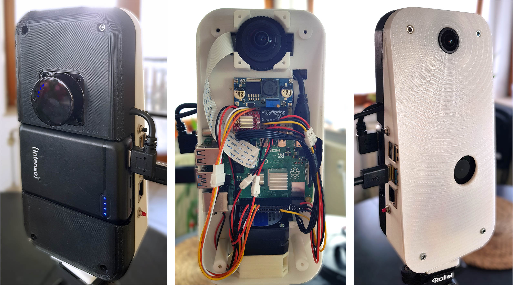

# PiLiDAR – DIY 360° 3D Panorama Scanner

PiLiDAR kombiniert einen LiDAR Sensor, eine Kamera und einen getriebeübersetzten
Schrittmotor zu einem vollständigen 3D-Scanner. Dieses Repository enthält einen
kompletten, kommentierten Workflow – vom Aufnehmen der Rohdaten über das
Stitchen eines Panoramas bis hin zur Erzeugung farbiger Punktwolken.

Die folgenden Kapitel erklären jeden Schritt so, dass auch absolute
Einsteiger*innen sicher zum Ergebnis kommen.

---

## 1. Installation und Vorbereitung

1. **Repository klonen**

   ```bash
   git clone https://github.com/<dein-account>/PiLiDAR.git
   cd PiLiDAR
   ```

2. **Python-Umgebung vorbereiten**  
   Eine virtuelle Umgebung verhindert Konflikte mit anderen Projekten:

   ```bash
   python3 -m venv .venv
   source .venv/bin/activate  # Windows: .venv\Scripts\activate
   pip install --upgrade pip
   pip install -r requirements.txt
   ```

3. **Hardware anschließen**

   - LDRobot STL27L LiDAR
   - Raspberry Pi HQ Kamera (oder kompatibel)
   - NEMA17 Schrittmotor mit A4988 Treiber und Planetengetriebe
   - Stromversorgung: 5 V für den LiDAR, 12 V bzw. passender Akku für den Motor

   Achte darauf, dass der Motor aufgrund des Getriebes langsam, aber sehr
   gleichmäßig bewegt wird. Die voreingestellten Mikroschritte und die im
   Code verwendeten Pausen sind darauf abgestimmt.

4. **Serielle Schnittstelle freischalten (nur Raspberry Pi)**

   ```bash
   sudo chmod a+rw /dev/ttyUSB0  # oder /dev/ttyS0 je nach Anschluss
   ```

5. **Optionale Extras**

   - Ein Taster kann über `gpio_interrupt.py` (liegt nun im Ordner `old/`) zum
     Starten genutzt werden.
   - Für eine automatische Panoramaerstellung sollte Hugin installiert sein.

---

## 2. Nutzung

### 2.1 Grafische Benutzeroberfläche

Die GUI richtet sich an Einsteiger*innen. Sie ermöglicht das Anpassen der
wichtigsten Parameter und das Starten/Stoppen des Scans.

```bash
python PiLiDAR.py --gui
```

*Wichtige Funktionen in der GUI*

- **Scan ID**: optionaler Name für den Durchlauf, wird als Ordnername benutzt.
- **Horizontale Auflösung**: bestimmt das Schrittmaß des Motors in Grad.
- **Scanwinkel**: begrenzt den vertikalen Scanbereich.
- **Schalter**: Kamera, LiDAR und 3D-Punktwolke können einzeln aktiviert werden.
- Der Statusbereich protokolliert jeden Arbeitsschritt. Nach Abschluss zeigt
  ein Hinweis den Speicherort aller Ergebnisse an.

### 2.2 Headless-Modus (Kommandozeile)

Wer direkt per Terminal arbeiten möchte, startet einfach:

```bash
python PiLiDAR.py
```

Der Lauf erzeugt automatisch alle Daten. Abbruch ist jederzeit mit `Strg+C`
möglich, der Controller stoppt den Motor und legt die Geräte sicher still.

---

## 3. Ergebnisdaten und Ordnerstruktur

Jeder Scan landet in einem eigenen Unterordner im Verzeichnis `scans/`.

```
scans/<SCAN-ID>/
├── img/                 # Einzelbilder für das Panorama
├── tmp/                 # Temporäre Dateien während der Verarbeitung
├── logs/                # Statusmeldungen und Zusatzinformationen
├── lidar/               # Legacy-Ordner (ältere Rohformate)
├── <SCAN-ID>_lidar.pkl  # Kompletter LiDAR-Rohdatensatz
├── <SCAN-ID>_intensity.ply  # Punktwolke mit Intensitätsfärbung
├── <SCAN-ID>_vertex.ply     # Punktwolke mit Bildfarben (falls Panorama vorhanden)
└── <SCAN-ID>_blended_fused.jpg  # Panorama aus den Kamerabildern
```

Alle Dateien werden automatisch erzeugt und mit sprechenden Namen versehen.

---

## 4. Welche LiDAR-Daten werden gespeichert?

Der neue Treiber speichert den kompletten Informationsgehalt jeder Messung:

- `timestamp`: Zeitstempel des Pakets in Millisekunden
- `speed`: Drehgeschwindigkeit des Sensors
- `angles_rad`: 12 Start-/Endwinkel innerhalb des Pakets (Radiant)
- `distances_mm`: 12 Distanzwerte in Millimetern
- `intensities`: 12 Intensitätswerte (0–255)
- `cartesian`: bereits umgerechnete X/Y-Koordinaten pro Messpunkt
- `z_angle`: aktuelle Plattformposition des Steppers für dieses Paket
- `z_angles`: Liste aller vertikalen Drehwinkel des Scans
- `angular`: polare Punktlisten für jede Ebene
- `cartesian_list`: kartesische Punktlisten für jede Ebene

Diese Daten ermöglichen es, später eigene Auswertungen (z. B. Filter oder
Registrierungen) aufzubauen, ohne erneut messen zu müssen.

---

## 5. Wichtige Skripte und Ordner

- `PiLiDAR.py` – Startskript, bietet Headless- und GUI-Modus.
- `lib/scan_controller.py` – zentrale Steuerlogik, koordiniert Motor, LiDAR,
  Kamera und Nachbearbeitung.
- `lib/lidar_driver.py` – neuer LiDAR-Treiber mit Strom-/Motorsteuerung,
  umfassender Datenspeicherung und Stop-Mechanismus.
- `lib/gui.py` – Tkinter Oberfläche für einfache Bedienung.
- `lib/pointcloud.py` – erzeugt Punktwolken (Intensität + Vertexfarben) und
  kapselt sämtliche Nachbearbeitungsschritte.
- `lib/config.py` – liest `config.json`, verwaltet Pfade, GPIO-Pins und sorgt
  für eine saubere Ordnerstruktur pro Scan.
- `old/` – enthält archivierte Testskripte (`meshing_test.py`, `process_3D.py`,
  usw.) sowie die ursprünglichen Installationshinweise.

Alle Module sind im Code umfangreich kommentiert. Dadurch lässt sich jeder
Arbeitsschritt nachvollziehen.

---

## 6. Hardwarehinweise

- **Stepper & Getriebe**: Der Motor wird mit 16-fach Mikrostepping betrieben.
  Durch das Planetengetriebe entsteht eine ruhige, ruckfreie Bewegung. Die
  Parameter `STEP_DELAY` und `SCAN_DELAY` im `config.json` können bei Bedarf
  feinjustiert werden.
- **LiDAR-Stromversorgung**: Der Treiber kann den Sensor über das Board
  ein- und ausschalten (`power_on()` / `power_off()` im Code). Ein externes
  Relais ist nicht notwendig.
- **Panorama**: Für bestmögliche Ergebnisse sollten alle Bilder mit identischer
  Belichtung aufgenommen werden. Die automatisch ermittelten Werte sind ein
  guter Ausgangspunkt; bei Bedarf lassen sie sich im GUI anpassen.



---

## 7. Fehlersuche & Tipps

- **LiDAR startet nicht**: Prüfe die serielle Verbindung (`/dev/ttyUSB0`) und
  ob `sudo chmod a+rw /dev/ttyUSB0` gesetzt wurde.
- **Punktwolke fehlt**: Stelle sicher, dass `ENABLE_3D` in `config.json` oder
  in der GUI aktiviert ist. Für Vertexfarben muss zusätzlich ein Panorama
  erzeugt werden.
- **Ruckeln während des Scans**: Reduziere `TARGET_SPEED` oder erhöhe
  `STEP_DELAY` leicht. Beide Werte lassen sich über die GUI anpassen.

---

## 8. Lizenz

PiLiDAR steht unter der MIT-Lizenz (siehe `LICENSE.md`). Beiträge und
Verbesserungen sind ausdrücklich willkommen.
