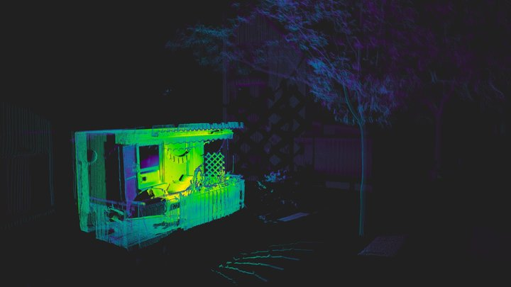
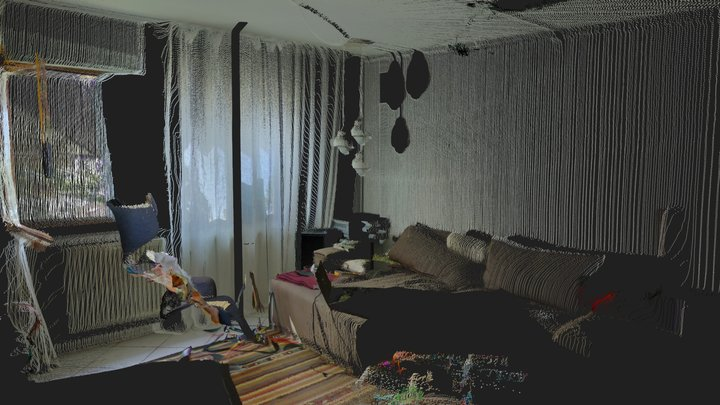
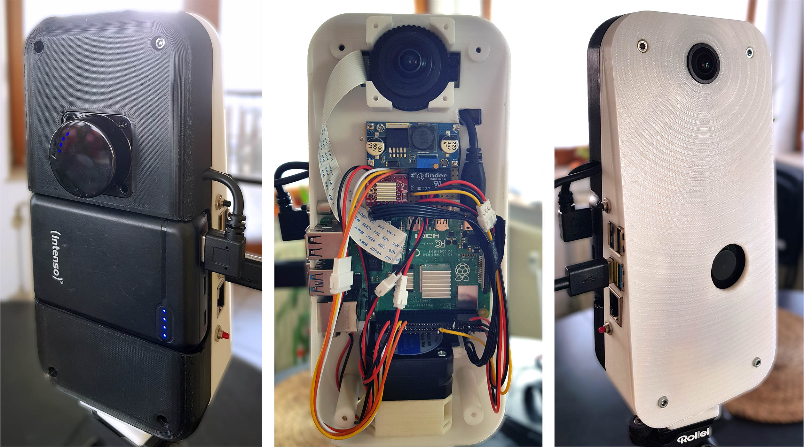
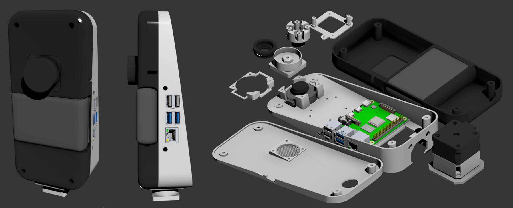
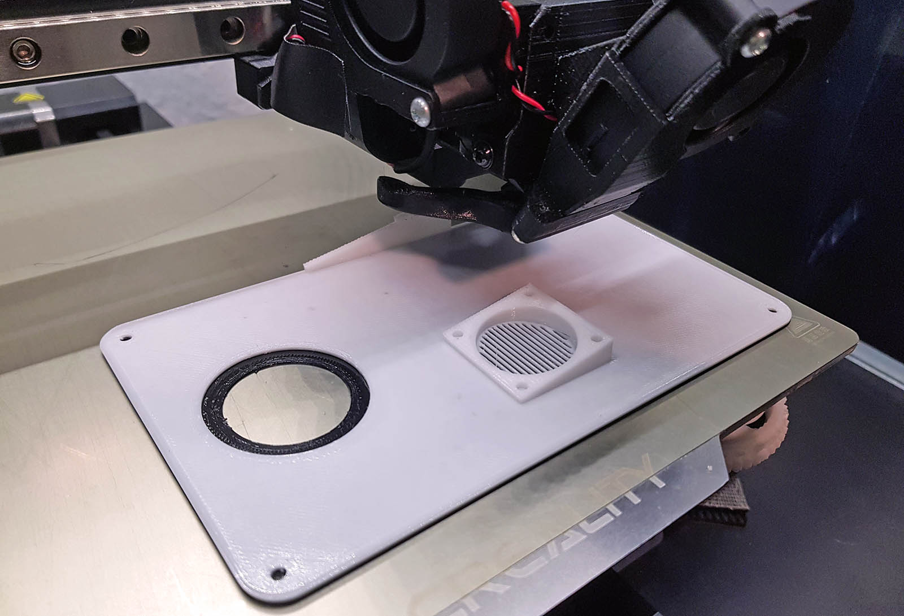

# PiLiDAR - DIY 360° 3D Panorama Scanner
## _WORK IN PROGRESS_

## Core Features:
- **LiDAR**: custom serial driver for LDRobot **STL27L**
    - CRC package integrity check
    - 2D live visualization and export (numpy or CSV)

- **Panorama**: 6K 360° spherical map
    - stitched from fisheye photos using [**Hugin** Panorama photo stitcher](https://hugin.sourceforge.io/)
    - constant camera exposure by reading EXIF data of automatic
    - constant white balance by iterative optimization of color gains

- **3D Scene**: assembly of 3D scenes from 2D planes based on angle and offsets
    - sampling **vertex colors from panorama**
    - Open3D visualization and export (PCD, PLY or [e57](https://github.com/davidcaron/pye57))
    - aligning multiple scenes using **global registration** and **ICP fine-tuning**
    - **Poisson Surface Meshing** (very slow on Pi4, recommended to run on PC)

## preliminary results
single scans, no registration, no post processing.  
klick the images to open the pointclouds in Sketchfab.

[](https://sketchfab.com/models/7997b63a3cb747f99b8f161862318bec/embed?autostart=1&ui_animations=0&ui_stop=0&ui_inspector=0&ui_watermark_link=0&ui_watermark=0&ui_ar=0&ui_help=0&ui_settings=0&ui_vr=0&ui_fullscreen=0&ui_annotations=0)  

*Exterior Scan (colormapped Intensity)*

[](https://sketchfab.com/models/0311c098c57b458abe3a5d3dda9fe92b/embed?autospin=0&autostart=1&ui_animations=0&ui_inspector=0&ui_watermark_link=0&ui_watermark=0&ui_ar=0&ui_help=0&ui_settings=0&ui_vr=0&ui_fullscreen=0&ui_annotations=0)  

*Interior Scan (Vertex Colors)*


## Hardware Specs:

- LDRobot STL27L LiDAR
- Raspberry Pi HQ Camera with ArduCam M12 Lens [(M25156H18, p.7)](https://www.arducam.com/doc/Arducam_M12_Lens_Kit_for_Pi_HQ_Camera.pdf)
- Raspberry Pi 4
- NEMA17 42-23 stepper with A4988 driver

- Power Supply: 
    - v1: 2x _18650_ Batteries (7.2V) with step-down converter
    - v2: 10.000 mAh USB Powerbank with step-up converter


*Rev. 1 using 2x 18650 Batteries and Buck Converter*



*Rev. 2 using 10.000 mAh Powerbank and Boost Converter*


### stepper driver, motor and gearbox

- A4988 bipolar stepper driver ([tutorial](https://www.youtube.com/watch?v=PMS5jY7RTjo))  
- NEMA17 42x42x23 bipolar stepper ([17HE08-1004S](https://www.omc-stepperonline.com/e-series-nema-17-bipolar-1-8deg-17ncm-24-07oz-in-1a-42x42x23mm-4-wires-17he08-1004s), 17 Ncm torque)
- 3D-printed planetary reduction gearbox (see [FDM / 3D printing](#fdm--3d-printing))


### LDRobot LiDAR Specs


- sampling frequency: 21600 Hz
- baudrate 921600
- [datasheet](https://github.com/May-DFRobot/DFRobot/blob/master/SEN0589_Datasheet.pdf)
- [wiki](https://www.waveshare.com/wiki/DTOF_LIDAR_STL27L)
- ROS2 driver [git](https://github.com/ldrobotSensorTeam/ldlidar_stl_ros2?tab=readme-ov-file#Instructions)

Scan duration:
12s initialisation
17s shooting 4x photos
1:24m scanning 0.167° x 0.18°
37s stitching, cleanup


## wiring


*Breadboard Rev. 2*


- UART Tx (yellow)
- GND (black)
- VCC 5V (red)

### Raspberry Pi:
- Power Button: GP03
- Scan Button: GP17
- A4988 direction: GP26, step: GP19
- A4988 microstepping mode: GP5, GP6, GP13


## Setup

### Power Button (Wakeup & Shutdown)
- Wakeup is hardwired to Pin 3
- enable gpio-shutdown

    
        echo "dtoverlay=gpio-shutdown" >> /boot/firmware/config.txt 

- if necesessary:  
    
        sudo nano /etc/systemd/logind.conf
        HandlePowerKey=poweroff


### Power LED and CPU fan

    # CPU fan at lower temp
    echo "dtoverlay=gpio-fan,gpiopin=4,temp=45000" >> /boot/firmware/config.txt
    

    # Power LED Heartbeat:
    echo "dtparam=pwr_led_trigger=timer" >> /boot/firmware/config.txt

### Scan Button: register GPIO interrupt
make script executable:

    chmod +x gpio_interrupt.py


create new service for autostart

    sudo nano /etc/systemd/system/pilidar.service

content:

    [Unit]
    Description=PiLiDAR-Button
    After=network.target

    [Service]
    Type=simple
    User=pi
    Environment=LG_WD=/tmp
    ExecStart=/usr/bin/python3 /home/pi/PiLiDAR/gpio_interrupt.py
    Restart=no

    [Install]
    WantedBy=multi-user.target

reload daemon, enable and start service:

    sudo systemctl daemon-reload
    sudo systemctl enable pilidar.service
    sudo systemctl start pilidar.service

check service if necessary:

    sudo systemctl status pilidar.service


### set Permission for UART on Raspberry Pi
temporary solution: 

    sudo chmod a+rw /dev/ttyS0

#### old solution: make it permanent by disabling password for chmod:  

    sudo visudo
    pi ALL=(ALL:ALL) NOPASSWD: /usr/bin/chmod a+rw /dev/ttyS0

then execute the _temporary_ solution from python:

    import subprocess
    command = "sudo chmod a+rw /dev/ttyS0"
    process = subprocess.Popen(command.split(), stdout=subprocess.PIPE)
    output, error = process.communicate()

#### new solution: grant permissions to the serial port using udev rules 

(TODO: check and remove old!)
- forget about `visudo` and the subprocess call above.
- Open a terminal and run the following command: `sudo nano /etc/udev/rules.d/50-ttyS0.rules`
- Write the following line in the file and save it: `KERNEL=="ttyS0",GROUP="dialout",MODE="0660"`
- Run the following command to check if your user is a member of the dialout group: `groups`
- If you see `dialout` in the output, you are already a member of the group. If not, run the following command to add your user to the group: `sudo usermod -a -G dialout pi`
- Run the following command to reload the udev rules: `sudo udevadm control --reload-rules`
- Unplug and replug the serial device, or reboot the system, to apply the changes.

### Panorama Stitching
install Hugin with enblend plugin

    sudo apt-get install hugin-tools enblend


### power switching the USB port

using [uhubctl](https://www.baeldung.com/linux/control-usb-power-supply) cli tool. install:  
    
    sudo apt-get install uhubctl

list all available hubs and devices

    sudo uhubctl

powering Raspberry Pi's USB-3-Ports (Hub 2) off / on

    sudo uhubctl -l 2 -a off
    sudo uhubctl -l 2 -a on


### jupyter über remote-ssh
Starte Jupyter ohne Token oder Passwort:

    jupyter notebook --ip 0.0.0.0 --no-browser \
        --NotebookApp.token='' --NotebookApp.password='' PiLiDAR.ipynb


## FDM / 3D printing

### 3D model files:
- ! Housing and additional parts (obj and 3mf)  in [the PiLiDAR-Hardware Repo](https://github.com/PiLiDAR/PiLiDAR-Hardware/tree/main/FDM) !

- M12 to C-Mount lens adapter ([thingiverse.com](https://www.thingiverse.com/thing:4444398))

- NEMA17 planetary reduction gearbox ([printables.com](https://www.printables.com/de/model/782336-nema17-planetary-gearbox-fixed))


*Housing CAD model Rev. 2*



*FDM printing the old front panel (Rev. 1) in PETG*


## remote Open3D Visualization

using ~~[_Web Visualizer_](https://www.open3d.org/docs/release/tutorial/visualization/web_visualizer.html)~~ [Plotly](https://plotly.com/python/) to display 3D pointclouds works great in Jupyter.  

Plotly seems to render client-sided, unlike Open3D Web Visualizer which renders host-sided and streams jpg sequences, which strains the Pi's both CPU and WIFI.


## Dumping Scans to USB Storage

1. Clone the Repo and run the installer:
    ```
    cd /home/pi/PiLiDAR
    git clone https://github.com/LaserBorg/usb_dump --depth 1
    cd usb_dump && chmod +x install.sh && ./install.sh "$(pwd)"
    ```
2. Create the config file:
    ```
    echo '{"source_directories": ["/home/pi/PiLiDAR/scans"], "target_root_directory": null}' > usbdump.json
    ```


### Troubleshoot USB_dump:
-  Check the log file:
    ```
    tail -f /tmp/usbdump.log
    ```

- to uninstall the service, run
    ```
    chmod +x uninstall.sh && ./uninstall.sh
    ```

- if the mount point is still persistend after being removed, just delete them.
    ```
    sudo rm -rf /media/pi/<your device name>
    ```


## Troubleshooting

### Windows Serial Driver
get [CP210x_Universal_Windows_Driver.zip](https://files.waveshare.com/upload/6/63/CP210x_Universal_Windows_Driver.zip) here:  
https://www.waveshare.com/wiki/DTOF_LIDAR_STL27L#Software_Download

### RPi.GPIO RuntimeError: Failed to add edge detection
current bookworm version has deprecated sysfs GPIO interface removed.  
use [LGPIO](https://pypi.org/project/rpi-lgpio/) as described [here](https://raspberrypi.stackexchange.com/questions/147332/rpi-gpio-runtimeerror-failed-to-add-edge-detection):

    sudo apt remove python3-rpi.gpio
    sudo apt update

    sudo apt install python3-rpi-lgpio

    # or in an env without system packages:
    pip3 install rpi-lgpio

LGPIO creates temp-files ([issue](https://github.com/joan2937/lg/issues/12)) like ".lgd-nfy0". gpio-interrupt.py executes 'export LG_WD=/tmp' to set it's CWD.


### poor performance of VS Code on Raspberry Pi

disable hardware acceleration for VS Code ([source](https://code.visualstudio.com/docs/setup/raspberry-pi))

    Preferences: Configure Runtime Arguments  
    Set "disable-hardware-acceleration": true

### pye57 on Raspberry Pi
there is no wheel for arm64. build requires libxerces:

    sudo apt install libxerces-c-dev
    pip install pye57

### add WIFI via SSH

[tutorial](https://u-labs.de/portal/raspberry-pi-wlan-verbindung-nachtraeglich-einrichten-oder-aendern-so-geht-es-grafisch-konsole/):

    sudo nano /etc/wpa_supplicant/wpa_supplicant.conf

    # make sure country code is set:
    country=DE

add entry to wpa_supplicant.conf

    sudo wpa_passphrase "YOUR_SSID" "YOUR_PASSWORD" | sudo tee -a /etc/wpa_supplicant/wpa_supplicant.conf


## references:

inspirations
- [ShaunPrice's](https://github.com/ShaunPrice/360-camera) StereoPi-supporting fork of [BrianBock's](https://github.com/BrianBock/360-camera) 360-camera script (Article on [Medium](https://medium.com/stereopi/stitching-360-panorama-with-raspberry-pi-cm3-stereopi-and-two-fisheye-cameras-step-by-step-guide-aeca3ff35871))

another Lidar implementation in Python
- [pyLIDAR](https://github.com/Paradoxdruid/pyLIDAR)


ICP implementations:
- Aeva [Doppler-ICP](https://github.com/aevainc/Doppler-ICP/blob/main/README.md)
- Photogrammetry & Robotics Bonn [KISS-ICP](https://github.com/PRBonn/kiss-icp) and [Lidar-Visualizer](https://github.com/PRBonn/lidar-visualizer)

3D Demo Data for global registration, ICP, meshing etc.:
- [BunnyMesh.ply](https://github.com/isl-org/open3d_downloads/releases/download/20220201-data/BunnyMesh.ply) from [20220201-data](https://github.com/isl-org/open3d_downloads/releases/tag/20220201-data)
- [DemoICPPointClouds.zip](https://github.com/isl-org/open3d_downloads/releases/download/20220301-data/DemoICPPointClouds.zip) from [20220301-data](https://github.com/isl-org/open3d_downloads/releases/tag/20220301-data)

Using a MOSFET for switching: [tutorial](https://elinux.org/RPi_GPIO_Interface_Circuits#Using_a_FET)

A4988 Enable, Sleep and Reset [tutorial](https://www.youtube.com/watch?v=PMS5jY7RTjo)
